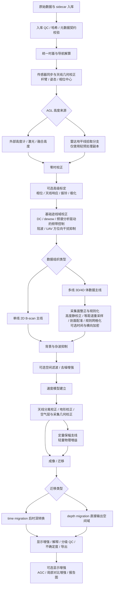

# MyGPR UAV-GPR 最终数据处理流程

> [!summary]
> 本文档是经过多轮调研、对比 Geolitix / GPRPy / RGPR / UAV-GPR 文献和 MyGPR 当前代码能力后形成的收口版本。核心结论是：MyGPR 不应被定义为一条固定死顺序的线性菜单，而应发展为 **依赖驱动、分支明确、全过程记录的 UAV-GPR 专用处理系统**。

## 一句话结论

MyGPR 的最终目标流程应采用：

```text
数据入库与 QC
→ 传感器同步与天线几何校正
→ 零时与基础信号校正
→ AGL / 采集几何校正
→ 单线 B-scan 或 3D/4D 体数据分流
→ 背景杂波抑制与可选去噪
→ 速度模型与几何-深度校正
→ 成像 / 迁移
→ 显示增强
→ 解释 / QC / 不确定度 / 导出
```

但在软件实现上必须区分：

- **目标架构版**：论文、长期产品路线、系统总设计使用。
- **当前可执行版**：当前 MyGPR GUI / CLI / benchmark 已能较稳定支持的子链。

---

# 1. 最终判断

## 1.1 不是唯一死顺序，而是依赖驱动流程

UAV-GPR 的处理步骤之间存在依赖关系，但并不存在所有场景都唯一正确的固定顺序。

例如：

- 有些 UAV-GPR 工作流会先做规则网格化，再做 time-zero / dewow。
- 有些体数据工作流会先做 static shift / profile registration，再做 mean-trace / dewow / migration。
- Geolitix 也允许大多数处理步骤重排，但要求 time-zero、trace shifting、等距道重采样等影响定位或时间轴的步骤放在前端。

因此，MyGPR 的内部实现方向应是 **DAG / 依赖图式处理引擎**，而不是单纯固定菜单。

## 1.2 运动补偿必须拆成两层

过去把“运动补偿”当作一个单独算法是不够准确的。

更合理的拆法是：

```text
前置几何绑定：
统一时基、RTK/IMU/高度计同步、杆臂修正、姿态修正、天线相位中心计算

后置采集面整正：
AGL 高度静校正、等距道重采样、剖面配准、规则网格化、可选时间/横向加密
```

当前 MyGPR 的 `motion_compensation_v2` 已经覆盖了其中一部分能力，但还没有完整覆盖体数据规则网格化、剖面残差配准和速度模型服务。

## 1.3 单线 B-scan 和 3D/4D 体数据必须分流

MyGPR 当前主要定位仍是 B-scan 检查、处理、自动选参和报告生成。

因此：

- 单条测线不应强制进入 crossline densification、3D regular grid、3D migration。
- 多测线 3D/4D 体数据才需要剖面配准、规则网格化、横向加密、轨迹感知迁移。

## 1.4 AGL 高度来源必须条件分支

UAV-GPR 的离地高度不能简单等同于 RTK altitude。

AGL 高度来源至少有两类：

```text
外部来源：
高度计 / 激光 / LiDAR / 融合导航 sidecar

雷达来源：
从 air-ground interface / 地表反射拾取
```

如果高度来自雷达地平线拾取，必须在 **轻预处理副本** 上完成，不能先做强背景抑制，否则地表反射可能已被删掉。

## 1.5 增益必须区分保幅和显示增强

增益不应笼统作为一个固定节点。

建议分为：

```text
定量保幅支线：
轻量物理增益，如时间幂增益、SEC / 平滑指数衰减补偿

显示增强支线：
AGC、局部归一化、局部对比增强
```

AGC 默认不应进入速度分析、保幅评价和定量迁移输入。它更适合用于迁移后显示、报告图和人工解释增强。

## 1.6 速度模型必须显式存在

速度模型不能继续隐含在“迁移”里。

但 UAV 离地采集存在空气层、地表折射、飞行高度变化，因此不应把普通双曲线拟合当作默认速度分析方案。

更合理的优先级是：

```text
CMP / WARR / 标定目标
→ 考虑空气层与折射的速度分析
→ 受限条件下的双曲线拟合
```

---

# 2. 目标架构版流程

> [!important]
> 这是 MyGPR 的长期规范目标链，适合写进论文方法章节、软件设计文档和长期开发路线。它不代表当前 MyGPR 已经全部实现。



---

# 3. 对外汇报简洁版

> [!note]
> 这是给导师、组会、答辩或非代码人员看的版本。它保留关键算法环节，但不过度展示工程分支。

```text
数据导入与入库校验
        ↓
传感器同步与天线几何校正
        ↓
零时校正
        ↓
基础信号校正
（DC / dewow / 频带 / 陷波 / UAV 干扰抑制）
        ↓
AGL 与采集几何校正
        ↓
单线解释或体数据规则化
        ↓
背景杂波抑制与可选去噪
        ↓
速度模型与迁移准备
        ↓
成像 / 迁移
        ↓
显示增强（可选）
        ↓
解释 / QC / 不确定度 / 导出
```

---

# 4. 当前 MyGPR 可执行版

> [!warning]
> 这是当前 MyGPR 更诚实的可执行链。它不应被写成“最终全部能力已实现”。

```text
数据导入与入库校验
        ↓
零时校正
        ↓
基础迹线域校正
（DC 去偏 / dewow / 频带控制 / 陷波 / 异常道处理）
        ↓
UAV-GPR 采集几何校正与运动补偿
        ↓
背景与杂波抑制
（背景扣除 / SVD 低秩抑制 / f-k 或方向性滤波）
        ↓
可选空间滤波与去噪增强
（中值滤波 / 小波去噪 / 温和 SVD 去噪）
        ↓
速度模型建立
        ↓
几何-深度校正
        ↓
定量保幅增益补偿
（SEC / 时间幂增益 / 指数增益 / 能量衰减补偿）
        ↓
成像 / 迁移
（当前以 Kirchhoff 偏移为主）
```

## 4.1 当前已具备的能力

当前 MyGPR 已经具备或部分具备：

- CSV / B-scan 数据导入与基础处理。
- 多种经典 GPR 算法方法注册。
- 推荐 profile / stage 驱动的顺序执行。
- 自动选参雏形。
- runtime warning 与部分数据清洗提示。
- sidecar / trace metadata 的设计基础。
- `motion_compensation_v2` 的部分实现：
  - AGL 高度时移校正。
  - 使用空气波速 `c0 = 0.299792458 m/ns`。
  - 姿态 / APC 足迹元数据更新。
  - 可选等距道重采样。
  - 缺少 `height_agl_m` 时采用兼容回退逻辑。
- gprMax benchmark 与报告生成基础。

## 4.2 当前尚未完整具备的能力

以下能力属于目标架构要求，但当前 MyGPR 还不能假装完全实现：

- 完整 DAG / 依赖图调度器。
- 字段级 sidecar schema 与依赖校验。
- 独立 velocity-model service。
- CMP / WARR / 折射感知速度分析。
- 天线分离校正服务。
- 地形校正 / 空气层几何校正公共服务。
- 体数据规则网格化。
- 剖面残差配准。
- crossline densification。
- UAV rotor-specific 方位向干扰抑制公共模块。
- 迁移前定量支线与迁移后显示增强支线的严格数据隔离。
- 全流程参数谱系、质量指标、不确定度输出。

## 4.3 当前高质量研究链

当前收口后的 MyGPR 高质量 UAV-GPR 工程主链，应以 **B-scan 可执行子链** 为主；它对应到现有 profile / 方法层时，可按下列方式落地：

```text
set_zero_time
        ↓
dewow
        ↓
frequency_filter_1d
        ↓
motion_compensation_v2
        ↓
subtracting_average_2D
        ↓
fk_filter
        ↓
wavelet_svd
        ↓
sec_gain
        ↓
optional migration / export
```

概念流程与当前方法的大致映射：

| 概念步骤 | 当前可用方法 / 实现方向 |
|---|---|
| 零时校正 | `set_zero_time` |
| 基础迹线域校正 | `dewow`, `frequency_filter_1d`；异常道处理需按现有坏道/尖峰处理能力补齐 |
| UAV-GPR 采集几何校正与运动补偿 | `motion_compensation_v2` |
| 背景与杂波抑制 | `subtracting_average_2D`, SVD 类背景抑制, `fk_filter` |
| 可选空间滤波与去噪增强 | 中值滤波、小波去噪、`wavelet_svd`、温和 SVD 去噪 |
| 速度模型建立 | 当前多为手动/参数化，需补 `velocity_model service` |
| 几何-深度校正 | 当前部分依赖迁移 / time-to-depth 参数，需补公共服务 |
| 定量保幅增益补偿 | `sec_gain` 优先，AGC 默认不进入该链 |
| 成像 / 迁移 | 当前以 Kirchhoff 偏移为主，Stolt / f-k 迁移作为后续扩展 |

这条链可以作为当前 GUI / CLI / benchmark 的主线。它的定位是 **B-scan 高质量可执行链**，不是完整 3D/4D UAV-GPR 目标架构链。

关键边界：

- `motion_compensation_v2` 是当前默认运动补偿入口，V1 仅保留兼容。
- `sec_gain` 比 AGC 更适合作为当前可执行链中的默认定量/半定量增益。
- `agcGain` 应默认归入显示增强支线，不应静默送入迁移或定量评价。
- `fk_filter` 和 `wavelet_svd` 是当前可用的空间/去噪增强环节，但 rotor-specific 方位向干扰抑制仍需单独实现。

---

# 5. 标准流程的关键节点说明

## 5.1 数据导入与入库 QC

目标不只是读入文件，而是建立可复现的数据对象。

应记录：

- 原始文件路径、哈希、大小、修改时间。
- 数据格式、采样率、采样点数、道数。
- 坐标系、单位、时间基准。
- sidecar 文件列表。
- 缺失字段与质量标志。

## 5.2 统一时基与导航解算

UAV-GPR 的雷达数据、RTK、IMU、高度计、飞控日志必须进入共同时间轴。

关键风险：

- 时间戳漂移。
- 传感器采样率不一致。
- RTK 时间与雷达触发时间存在延迟。
- UTC / GPS time / 本地时间混用。

## 5.3 传感器同步与天线几何校正

这一步解决“雷达真实测点在哪里”的问题。

需要处理：

- RTK 天线到 GPR 天线的杆臂。
- yaw / pitch / roll 姿态修正。
- 天线相位中心。
- 发射 / 接收天线安装几何。

## 5.4 AGL 高度来源判断

AGL 是 UAV-GPR 的核心变量之一。

优先级建议：

```text
激光 / 高度计 / 融合导航高度
→ RTK + DEM / 地形模型推算
→ 雷达地表反射拾取
→ 人工给定常高假设
```

从雷达拾取地平线时，必须使用轻预处理副本，避免背景抑制提前删除地表反射。

## 5.5 零时校正

零时校正是核心必做步骤。

目标：

- 对齐直达波或参考首波。
- 保持 air wave、ground reflection、subsurface reflection 的时间关系。
- 为后续 AGL 校正、速度分析、迁移提供时间基准。

风险：

- 参数过大导致有效数据被切掉。
- 把地表反射误识别为直达波。
- 不同高度下首波形态变化导致误拾取。

## 5.6 可选高级标定

包括：

- 相位校正。
- 天线响应校正。
- 振铃校正。
- 极化校准。
- mixed-phase deconvolution。

这些不是所有项目都必做。只有在具备标定数据、相位保真要求或 SAR / 极化应用时才应默认启用。

## 5.7 基础迹线域校正

包括：

- DC 去偏。
- dewow / 低频漂移抑制。
- 频谱分析驱动的频带控制。
- notch / 陷波。
- UAV 方位向干扰抑制。

频带控制不应理解为只做一次带通滤波。它可以在迹线域、网格域或成像域按需要多次调用。

## 5.8 采集面整正与规则化

对单线 B-scan：

- 可做等距道重采样。
- 可做高度静校正。
- 通常不需要 crossline 规则网格。

对 3D/4D 体数据：

- 必须考虑剖面配准。
- 必须考虑规则网格化。
- 可做时间高密化和横向加密。
- 迁移前需要更严格的轨迹一致性检查。

## 5.9 背景与杂波抑制

目标：

- 抑制稳定直达波尾迹。
- 抑制水平条纹。
- 抑制公共模式背景。
- 降低系统耦合波和稳定空气-地表界面反射的影响。

风险：

- 误删横向连续真实反射。
- 误删地表反射，导致后续 AGL / horizon pick 失败。
- SVD / 均值背景过强导致目标泄漏。

## 5.10 可选空间滤波 / 去噪增强

适用场景：

- 明显方向性噪声。
- 周期性空间噪声。
- 斜向干扰。
- 旋翼或平台造成的方位向干扰。
- 图像增强或目标检测前处理。

该步骤不是必经步骤。

## 5.11 速度模型与几何-深度校正

速度模型是迁移和深度解释的基础。

UAV-GPR 场景下要注意：

- 空气层速度与地下介质速度差异很大。
- 离地高度会影响双曲线形态。
- 空气-地面折射会影响速度分析。
- 普通双曲线拟合不能作为默认唯一方案。

## 5.12 增益补偿

建议采用双分支：

```text
定量保幅支线：
SEC / 时间幂增益 / 平滑指数补偿

显示增强支线：
AGC / 局部归一化 / 对比增强
```

AGC 可用于展示，但不要默认作为定量解释依据。

## 5.13 成像 / 迁移

迁移依赖：

- 速度模型。
- 采集几何。
- 天线分离信息。
- 地形或 AGL 信息。

常见路线：

- Kirchhoff migration。
- Stolt / f-k migration。
- PSM。
- RTM。

time migration 后可再做 time-to-depth；depth migration 则直接输出空间域结果。

## 5.14 解释 / QC / 不确定度 / 导出

最终输出不应只有图片。

至少应包括：

- 原始数据摘要。
- 处理步骤历史。
- 每步参数。
- 自动选参结果与候选分数。
- 中间结果。
- 最终 B-scan / migrated image。
- 速度模型。
- QC 指标。
- 风险提示。
- 不确定度或置信度。

---

# 6. 数据契约与方法契约

第六轮调研的核心新增结论是：下一步最应该冻结的不是某一组算法参数，而是 **统一数据契约 + 方法契约**。只有字段语义稳定，DAG、自动选参、AGL 融合、速度模型、报告复现才有共同基础。

## 6.1 统一数据契约

建议先冻结下面这些最小对象：

| 对象 | 最小必填字段 | 用途 |
|---|---|---|
| `data` | `float32[samples, traces]` | 当前处理域内的二维 B-scan 主数组 |
| `header_info` | `a_scan_length`, `num_traces`, `total_time_ns`；可选 `trace_interval_m`, `track_length_m`, `radar_center_frequency_hz` | 定义时间轴、采样率推导、迁移和深度转换上下文 |
| `trace_metadata` | `trace_index`, `trace_timestamp_s`；建议含 `trace_distance_m`, `local_x_m`, `local_y_m`, `roll_deg`, `pitch_deg`, `yaw_deg`, `height_agl_m`, `height_source`, `height_confidence` | 几何、同步、AGL 和 per-trace QC 的基础 |
| `velocity_model` | `mode`, `v_ground_m_per_ns` 或 `epsilon_r`, `uncertainty`, `source` | 迁移、时深转换、天线分离和地形/空气层校正的公共依赖 |
| `provenance_qc` | `source_hashes`, `method_history`, `runtime_warnings`, `quality_flags`, `artifacts` | 支持科研复现、自动报告、审计和回归测试 |

## 6.2 方法依赖声明草案

未来 MyGPR 每个处理方法建议增加类似声明：

```yaml
method_id: motion_compensation_v2
display_name: Motion Compensation V2
domain: trace
requires:
  - trace_metadata.height_agl_m
optional_requires:
  - trace_metadata.pitch_deg
  - trace_metadata.roll_deg
  - trace_metadata.yaw_deg
  - installation.lever_arm_m
  - installation.phase_center_offset_m
outputs:
  - data
  - trace_metadata_out
output_class: quantitative
affects_amplitude: true
affects_time_axis: true
requires_velocity_model: false
warnings:
  - missing_height_agl
  - fallback_flight_height
  - resampling_changed_trace_count
```

第六轮报告建议在 `requires`、`requires_velocity_model`、`domain`、`output_class` 之外，再补充三个字段：

- `requires_one_of`：表达多选一依赖，例如外部 `height_agl_m` 或雷达地平线拾取结果满足其一即可。
- `invalidates`：表达输出会破坏哪些定量性质，例如 AGC 破坏相对振幅。
- `capability_level`：表达能力状态，例如 `implemented`、`partial`、`planned`。

增益方法示例：

```yaml
method_id: agc_gain
domain: trace
requires: []
output_class: display
affects_amplitude: true
preserves_relative_amplitude: false
invalidates:
  - quantitative_amplitude
recommended_branch: display_enhancement
not_recommended_for:
  - velocity_analysis
  - quantitative_amplitude_analysis
  - pre_migration_default
```

速度模型服务示例：

```yaml
service_id: velocity_model
requires_one_of:
  - cmp_data
  - warr_data
  - calibration_target
  - manual_velocity
  - refraction_aware_estimation
outputs:
  - velocity_model
  - uncertainty
required_by:
  - migration
  - time_to_depth
  - antenna_separation_correction
  - topographic_correction
```

## 6.3 ProcessingContext / ProcessingResult 草案

为了让 `processing_engine` 从“单方法顺序执行”演进为“契约驱动执行”，建议逐步收口到统一上下文对象：

```python
@dataclass
class ProcessingContext:
    data: np.ndarray
    header_info: dict
    trace_metadata: dict
    velocity_model: dict | None = None
    artifacts: dict = field(default_factory=dict)
    qc: dict = field(default_factory=dict)
    provenance: list[dict] = field(default_factory=list)
    domain: str = "trace"
    output_class: str = "quantitative"

@dataclass
class ProcessingResult:
    data: np.ndarray
    header_info_updates: dict = field(default_factory=dict)
    trace_metadata_updates: dict = field(default_factory=dict)
    artifacts: dict = field(default_factory=dict)
    qc: dict = field(default_factory=dict)
    warnings: list[dict] = field(default_factory=list)
    domain_out: str = "trace"
    output_class: str = "quantitative"
```

调度器可以先保持轻量：

```python
def resolve_execution_plan(requested_methods: list[str], ctx: ProcessingContext):
    graph = build_dependency_graph(requested_methods, PROCESSING_METHODS)
    ensure_contracts_satisfied(graph, ctx)
    enforce_branch_rules(graph)
    return topological_sort(graph)
```

---

# 7. 开发优先级

## 7.1 第一批：立即做

这些是把当前流程从“文档愿景”推进为“软件事实”的关键。

- 统一 sidecar schema。
- 方法注册表增加依赖声明。
- 方法注册表增加 domain 声明：
  - `trace`
  - `grid`
  - `image`
  - `volume`
- 方法输出增加类型声明：
  - `quantitative`
  - `display`
  - `intermediate`
- UI / CLI 显示能力标签。
- 当前可执行链和目标架构链分开写入文档。
- 处理历史和参数谱系结构化记录。

## 7.2 第二批：尽快做

- 雷达地平线拾取与 AGL 融合。
- UAV 方位向干扰抑制公共模块。
- velocity-model service。
- 天线分离校正服务。
- 增益自动选择：
  - SEC / AGC / exponential / tpow 对比。
  - 根据数据特征选择显示或保幅支线。
- 自动选参评分指标升级：
  - 目标结构保真度。
  - 背景压制程度。
  - 边缘保持。
  - 深部不过曝。
  - 真值 ROI 信号保持率。

## 7.3 第三批：中长期做

- 剖面残差配准。
- 体数据规则网格化。
- crossline densification。
- 轨迹感知迁移。
- 近实时 SAR / PSM。
- 物理约束机器学习辅助选参。
- gprMax UAV-GPR benchmark 扩展为论文级评测基准。

---

# 8. 验证与回归指标

第六轮报告强调：流程定稿后必须把正确性验证写成可回归指标，而不是只靠“图像看起来更好”。

## 8.1 必须自动测试的三条规则

- sidecar 时间范围不足时必须告警，不能静默外推。
- 几何校正后 `trace_metadata` 长度必须与数据道数一致。
- `display` 支线结果默认不得作为迁移、速度分析或深度转换输入。

## 8.2 推荐 QC 指标

| 指标组 | 建议指标 | 用途 |
|---|---|---|
| 时间/几何 | `zero_time_residual_std`, `horizon_flatness_rmse`, `trace_distance_monotonic_violations` | 验证零时、AGL 和重采样是否正确 |
| 导航/配准 | `sensor_time_overlap_ratio`, `profile_registration_rmse`, `grid_bin_residual` | 验证多传感器同步与体数据规则化 |
| 成像质量 | `focus_ratio`, `hyperbola_apex_shift`, `depth_rmse`, `contrast_gain` | 验证迁移与深度解释 |
| 振幅保真 | `ratio_fidelity`, `relative_amplitude_bias`, `display_branch_leakage` | 验证保幅/增强支线隔离 |
| 软件鲁棒性 | `warning_coverage`, `silent_extrapolation_count`, `provenance_completeness` | 验证工程可交付性 |
| 性能 | `elapsed_ms`, `peak_memory_mb`, `batch_throughput` | 验证 CLI / GUI 和近实时路线 |

## 8.3 推荐验证数据

- gprMax 合成数据：用于 AGL 静校正、姿态/杆臂、非均匀航迹和自动选参真值闭环。
- realistic multi-offset / multi-frequency synthetic benchmark：用于速度分析、迁移、去噪和反演稳定性。
- ground-vs-UAV low-frequency dataset：用于比较地面与 UAV 平台差异。
- 未来自采 CSV + RTK + IMU + 高度计数据：用于真实链路验证。

---

# 9. 论文方法章节建议写法

建议分成四层：

```text
采集与同步层
几何与时间校正层
信号处理层
成像与解释层
```

并明确写出：

- 哪些步骤是当前工程版本已启用的。
- 哪些步骤是规范要求但本次实验未启用的。
- 为什么某些高级模块降级为可选。
- 为什么 AGC 只作为显示增强，不作为定量保幅输入。
- 为什么 UAV-GPR 的速度分析要考虑空气层和折射。
- 为什么单线 B-scan 和 3D/4D 体数据要分流。

推荐表述：

> 本研究将 UAV-GPR 处理链设计为依赖驱动的分层流程，而非固定线性菜单。当前工程版本实现了 B-scan 主线中的导入、基础信号校正、运动补偿、背景抑制、增益、去噪与成像接口；体数据规则化、速度模型服务、天线分离校正和完整 DAG 调度作为后续版本扩展。

---

# 10. 和 Geolitix / GPRPy 的关系

## 9.1 Geolitix 给我们的启发

Geolitix 支持多种处理步骤重排，但要求影响定位和时间轴的步骤前置，例如：

- time zero。
- trace shifting。
- resample traces equidistantly。

同时，Geolitix 明确区分多种增益方式，并指出 AGC 会丢失相对振幅信息。

这支持 MyGPR 的两个判断：

- 影响几何和时间基准的步骤必须前置或满足依赖。
- AGC 不应作为默认定量处理输入。

## 9.2 GPRPy / RGPR 给我们的启发

GPRPy 和 RGPR 的关键价值不是简单多几个算法，而是：

- 有处理历史。
- 有速度、地形、天线分离、迁移之间的依赖关系。
- 可以复现处理流程。

MyGPR 应吸收这些思想，进一步产品化为：

- 参数谱系。
- 自动报告。
- 依赖检查。
- 能力标签。
- 分支处理。

---

# 11. 最终冻结语句

建议作为 MyGPR 项目内部统一口径：

> MyGPR 的 UAV-GPR 标准流程不是唯一固定顺序，而是一套依赖驱动的分层处理规范。目标架构覆盖传感器同步、天线几何校正、AGL 分支、基础信号校正、单线/体数据分流、速度模型、几何-深度校正、保幅/增强分支、成像迁移和全过程 QC。当前软件默认执行其中的 B-scan 可执行子链，并将在后续版本补齐 sidecar 数据契约、显式依赖调度、速度模型服务、体数据规则化和近实时成像能力。

---

# 12. 相关文档

- [[uav_gpr_standard_processing_flow]]
- [[motion_compensation_v2_design]]
- [[motion_compensation_v2_capability_audit_2026-05-11]]
- [[auto_tune_research_comparison_design]]
- [[uav_gpr_auto_tune_prior_art_and_roadmap]]
- [[gprmax_auto_tune_validation_plan]]
- [[gprmax_uavgpr_model_references]]

---

# 13. 当前结论

本轮流程讨论已经可以收口。

后续不再继续争论“背景抑制、增益、滤波谁先谁后”这类单线顺序问题，而应转向实现：

```text
方法依赖声明
→ sidecar 数据契约
→ 当前能力标签
→ 自动选参评分升级
→ AGL / 速度模型 / 体数据规则化补齐
```

这才是让 MyGPR 从实验软件走向论文、专利和工程产品的关键路径。
