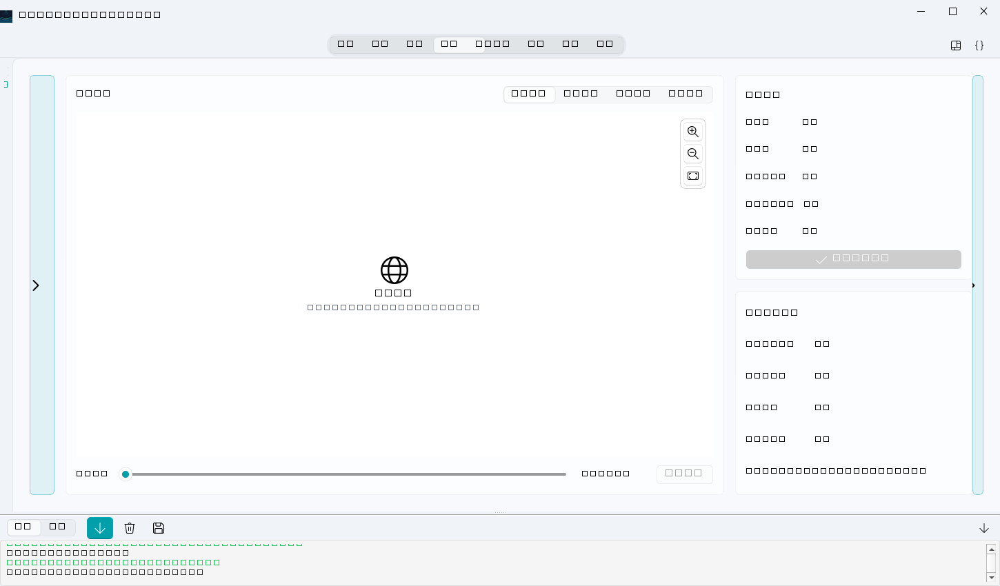

# 传感器同步

把 RTK / IMU / 高度计设备文件按时间轴对齐到雷达道，生成统一轨迹——**空间成果与三维视图的精度基础**。

## 前置

- 已导入测线（[导入测线数据](导入测线数据.md)）
- 设备侧车文件（CSV，首行表头含 `timestamp_s`）：
  - RTK：`timestamp_s,longitude,latitude`
  - IMU：`timestamp_s,roll_deg,pitch_deg,yaw_deg`
  - 高度计（可选）：`timestamp_s,height_agl_m` 等

## 操作

1. 项目页选中测线 → **传感器同步**。
2. 选择 RTK 文件与雷达道时间戳文件（`timestamp_s` 列），IMU/高度计可选。
3. 运行。完成后测线状态更新为「已同步」，显示 RTK 覆盖率与固定解比例。

## 结果产物

同步在项目内生成（`raw/<测线>/sensors/`）：

- `*_trajectory.csv` —— 统一轨迹（空间成果直接使用）
- `*_sensor_sync_trace_metadata.npz` —— 逐道姿态/高度元数据
- `*_sensor_sync_manifest.json` —— 来源文件清单与数据集信息

## 判读

- **RTK 覆盖率 ≥ 99%**：轨迹完整，可直接生成空间成果。
- **部分定位**：有缺段，空间成果仍可生成，但对应段落精度降级——交付前建议复核。
- 重复同步安全：每次同步整体替换 `sensors/` 目录，旧版本自动备份。

## 无界面方式

`MyGPRBackend.projects.synchronize_line_sensors(project_id, line_id, rtk_path=..., trace_timestamps_path=...)`，见[无界面批处理](无界面批处理.md)。
