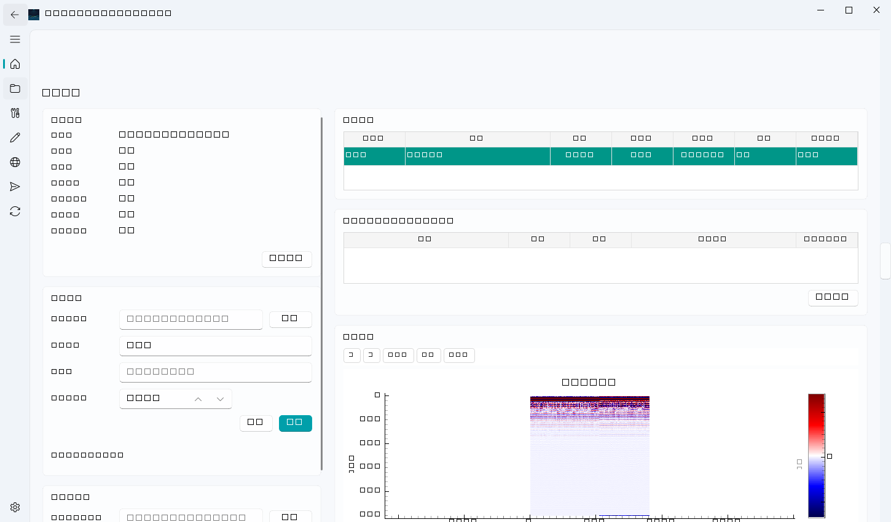

# 导入测线数据

## 通用流程

项目页 → **导入测线** → 选文件 → 预检确认格式与规模 → **导入**。导入全程事务性：取消或磁盘写满自动回滚，不留残留。

## 各格式要点

| 格式 | 必需伴随文件 | 注意事项 |
|---|---|---|
| MyGPR / 矩阵 CSV (`.csv` `.txt`) | — | 二维矩阵，或无人机堆叠 CSV（`经度,纬度,海拔,幅值,飞行高度`，前 4 行头信息） |
| MALÅ RD3/RD7 (`.rd3` `.rd7`) | 同名 `.rad` | `.rad` 提供 SAMPLES / TIME WINDOW / DISTANCE INTERVAL |
| Sensors & Software DT1 (`.dt1`) | 同名 `.hd` | `.hd` 为文本头；位置单位为 ft 时自动换算 m |
| GSSI DZT (`.dzt`) | — | 单通道 8/16/32 位 profile |
| Geotech OKO (`.gpr` `.gpr2`) | — | OKO-2 二进制；俄语头字段自动解码 |
| SEG-Y (`.sgy` `.segy`) | — | 固定采样数；int16/int32/float32 大端 |
| ENVI BSQ (`.dat`) | 同名 `.hdr` | `data type`/`interleave` 在 `.hdr` 声明 |
| ImpulseRadar (`.iprb`) | 同名 `.iprh` | 16/32 位 |
| gprMax (`.out`) | 同目录 `.in` | `.in` 用于补充道间距 |
| NumPy (`.npy` `.npz`) | — | 必须二维 B-scan 矩阵 |

伴随文件必须与数据文件**同目录同名**（仅扩展名不同）。

## 无人机 CSV 与轨迹

堆叠 CSV 自带经纬度/高度列，导入即有空间轨迹元数据。若另持 RTK/IMU 设备文件，导入后做一次[传感器同步](传感器同步.md)可提升轨迹精度——空间成果推荐使用同步后轨迹。

## 导入失败排查

| 报错 | 原因 |
|---|---|
| "文件截断/数据不足" | 头信息声明的采样点×道数大于实际数据行 |
| "无法解析的数值" | CSV 存在非数值列或空行，检查导出设置 |
| "不支持该格式" | 扩展名不在支持列表，或伴随文件缺失 |
| 磁盘写满后重新导入 | 正常重试即可，失败事务已整体回滚 |
