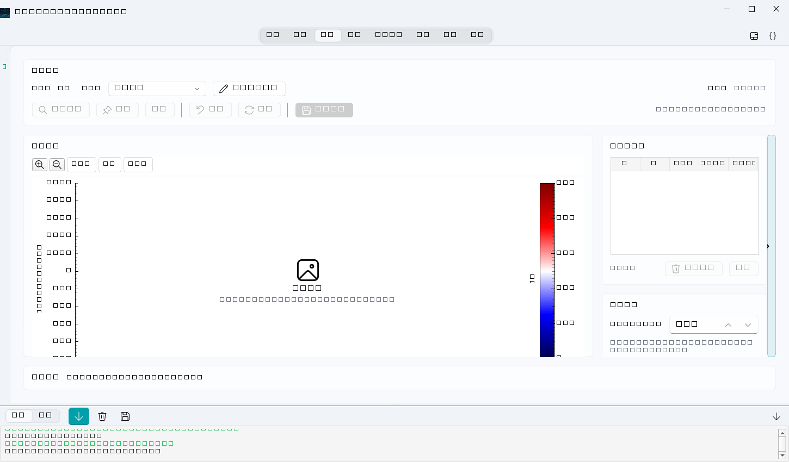

# 界面标注与空间成果

把解释结论（基覆界面）与空间轨迹合成可交付的地理定位成果。

## 界面标注

1. 解释页 **打开标注会话**，选择测线与数据源（处理成果或原始数据）。
2. 在 B-scan 上**逐道点击**基覆界面（覆盖层底界的强反射），或用 **自动追踪** 生成初值后修正。
3. 工具：吸附（贴近强反射轴）、平滑、区段标记（如"weak"）、撤销/重做。
4. **保存**。标注带版本管理：每次保存自动归档历史版本。
5. 交付前把标注状态改为 **已确认**——空间成果预检要求"已确认"状态，草稿会被拒绝。

## 空间成果

成果页 → **生成空间成果**：

1. 预检逐条检查所选测线：轨迹文件存在 + 界面标注已确认。
2. 通过后生成版本化成果（速度参数默认由测线介电常数推导，可手动指定）。
3. 空间页查看：轨迹图、成果版本列表、设为当前版本。

多次生成产生多个版本，历史版本不覆盖——对比分析时可在版本间切换。

## 常见失败

| 预检报错 | 处理 |
|---|---|
| "缺少基覆界面标注" | 先在解释页完成标注并保存 |
| "标注仍为草稿" | 标注状态改为已确认后重新保存 |
| "缺少 RTK/GNSS 轨迹" | 先做[传感器同步](传感器同步.md) |
| "没有同时具备……的测线" | 上述条件的组合未满足，逐条补齐 |
