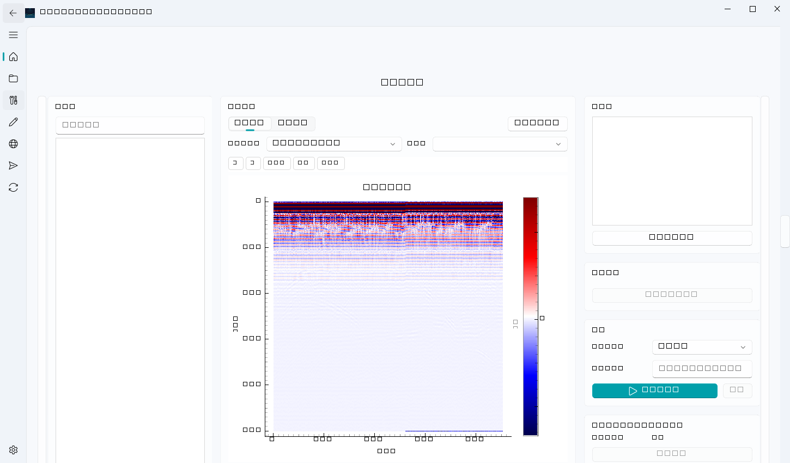
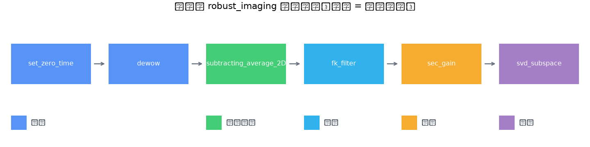

# 运行处理与 AutoTune

## 处理链编排

处理页方法库按分类列出全部 36 个算法（中文分类 + 推荐/备选/实验标签）。双击添加到处理链；链按顺序执行，每步输出作为下步输入。右侧参数表单提供类型/范围校验（越界值无法提交）。

## 预设档

不想手动编排时直接选预设档（自动展开为算法序列 + 推荐参数）：

| 预设档 | 用途 |
|---|---|
| `robust_imaging` | 通用稳健成像（零时矫正→去漂移→背景消除→FK 滤波→增益→SVD） |
| `high_quality_uav_gpr` | 无人机数据高质量流程 |
| `hankel_denoise` / `wavelet_2d_denoise` / `wavelet_svd_denoise` | 去噪专项 |
| `motion_compensation_v1/v2` | 无人机运动补偿 |
| `gprmax_impulse_validation` | gprMax 仿真验证 |

## AutoTune 自动调参

对**单步算法**点「开始调参」：在当前数据上按安全约束搜索参数空间，输出推荐值。

- 安全边界内置：所有候选按数据尺度（采样数/道数/时窗/奈奎斯特频率）夹紧，越界候选自动限幅并记录约束警告——不可能提交导致崩溃的参数。
- 输出：推荐参数、全部试验（含失败试验与原因）、Top-3 候选与偏好排序。
- 证据可导出：编程接口 `mygpr.application.autotune.evidence.export_autotune_evidence` 落盘 JSON（含 body SHA-256 防篡改），供报告附录与溯源。

## 处理成果

运行完成后结果自动成为**处理成果（Artifact）**：

- 与原始 B-scan 并排对比（处理页预览）
- 完整谱系：输入数据、算法、参数、运行时警告全部记入处理清单（SHA-256 证据链，见[原理解释](../explanation/处理证据链与数据安全.md)）
- 解释页标注默认基于最新处理成果；也可切换回原始数据

## 注意

- 大文件（多 GB）自动走分块/懒加载，无需担心内存。
- 运行中可随时在任务页取消；已写入内容整体回滚。
