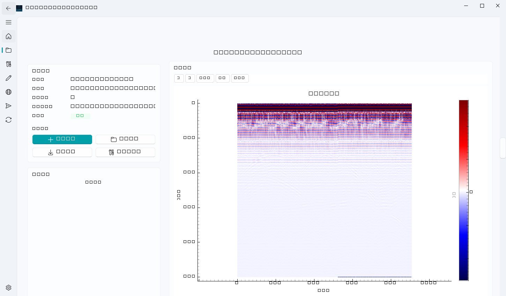
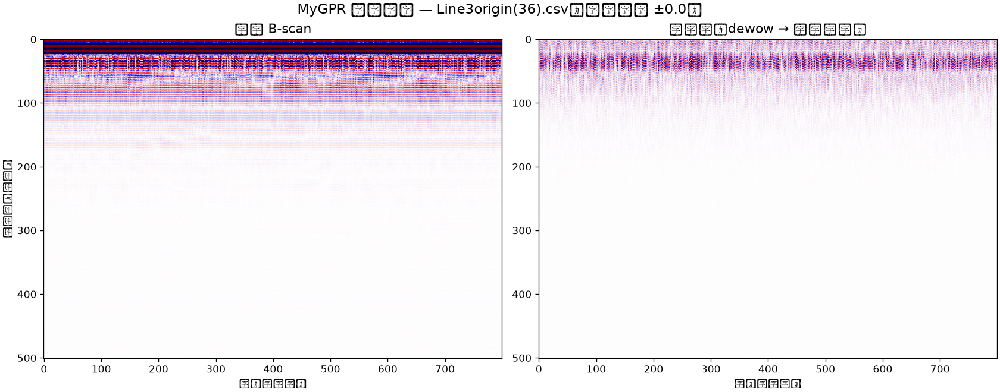

# 教程：第一次处理营山数据

> 学习导向：从零开始，用一条真实采集的测线数据走完「建项目 → 导入 → 处理 → 标注 → 成果」全流程。约 15 分钟。
> 本教程假设你已按 [README](../README.md) 完成安装并能启动 `python app_qt.py`。

## 你将得到

一个包含 1 条测线、1 个处理成果、1 份界面标注、1 个空间成果与 1 份报告包的完整 MyGPR 项目。

## 准备数据

任选其一：

- **有真实营山数据**：把 `02_Preprocessed_Standard` 目录下任一 `Line*origin(36).csv` 复制到方便的位置（如桌面）。
- **没有数据**：用软件自带样例 `sample_data/gui_sidecar_all_data_main.csv`（同为无人机 CSV 格式）。

数据为 MyGPR 无人机堆叠 CSV：前 4 行是头信息（采样点数/时窗/道数/道距），之后每行 `经度,纬度,海拔,幅值,飞行高度`。

## 第 1 步：新建项目

1. 启动 `python app_qt.py`，主页点 **新建项目**。
2. 选择一个空目录，项目名填 `yingshan-demo`。
3. 项目信息里把 **坐标系** 设为 `CGCS2000 / 3-degree GK zone 36`（营山数据在东经 106.8° 附近；坐标系是空间成果的必要条件，不设后面会失败）。

## 第 2 步：导入测线

1. 项目页点 **导入测线**，选刚才的 CSV。
2. 预检面板显示：格式 `mygpr-airborne-sidecar-csv`、矩阵规模（如 501 × 1813）、含轨迹列。
3. 点 **导入**。几秒后测线出现在列表，状态「已导入」。

> 导入失败会整体回滚不留残留；常见原因见下方 [故障排查](#故障排查)。

## 第 3 步：处理

1. 处理页从方法库双击 **低频漂移矫正（Dewow）** 和 **背景消除** 添加到处理链（或直接选预设档 `robust_imaging`）。
2. 右侧参数表单保持默认（或点 **开始调参** 让 AutoTune 自动搜索）。
3. 点 **运行处理链**。完成后结果自动生成处理成果并预览——你会看到背景漂移被去掉、反射同相轴更清晰。

## 第 4 步：界面标注

1. 解释页 **打开标注会话**，选择处理成果。
2. 在 B-scan 图上沿着连续的强反射层逐道点击（或用 **自动追踪** 后手动修正关键点）。
3. 点 **保存** 并把标注状态改为 **已确认**——草稿状态的标注无法生成空间成果。

## 第 5 步：空间成果

1. 成果页点 **生成空间成果**，命名 `demo-result`。
2. 预检通过（测线需同时有轨迹 + 已确认标注）后生成带版本号的空间成果。
3. 空间页可查看轨迹与成果版本。

## 第 6 步：报告包

1. 成果页点 **生成报告包**。
2. 完成后打开交付目录：PDF/HTML/Excel 报告、图件、文件审计与 SHA-256 校验和清单全部自包含，可直接交付。

## 小结与下一步

你已经走完核心闭环。接下来：

- 数据是 MALÅ/GSSI/S&S 等厂商格式？→ [导入测线数据](../how-to/导入测线数据.md)
- 想理解每步处理留下了什么证据？→ [处理证据链与数据安全](../explanation/处理证据链与数据安全.md)
- 具体任务速查 → [任务指南索引](../how-to/index.md)

## 故障排查

| 现象 | 原因与处理 |
|---|---|
| 导入报"文件截断/数据不足" | CSV 头声明的采样点×道数大于实际行数，用采集软件重新导出 |
| 空间成果预检失败 | 缺轨迹文件（先做传感器同步）或标注仍是草稿（先确认） |
| 3D 视图无轨迹 | 未设坐标系或未做传感器同步 |
| 更多 | [用户文档首页](../README.md) 的故障排查表 |
