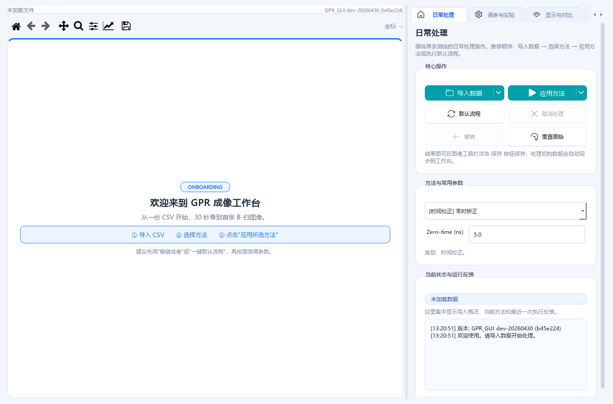
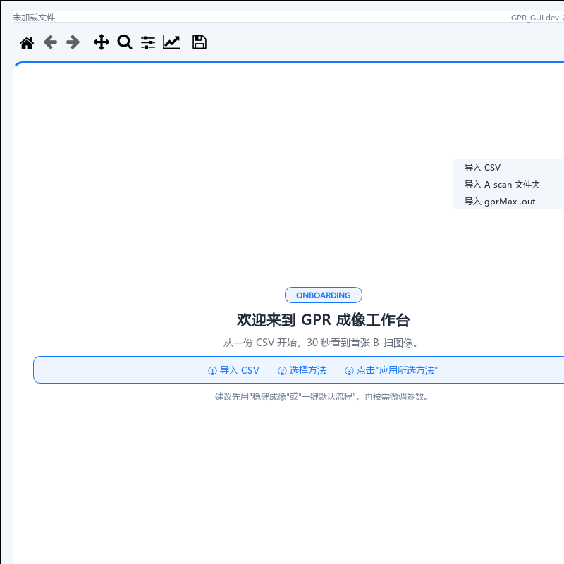
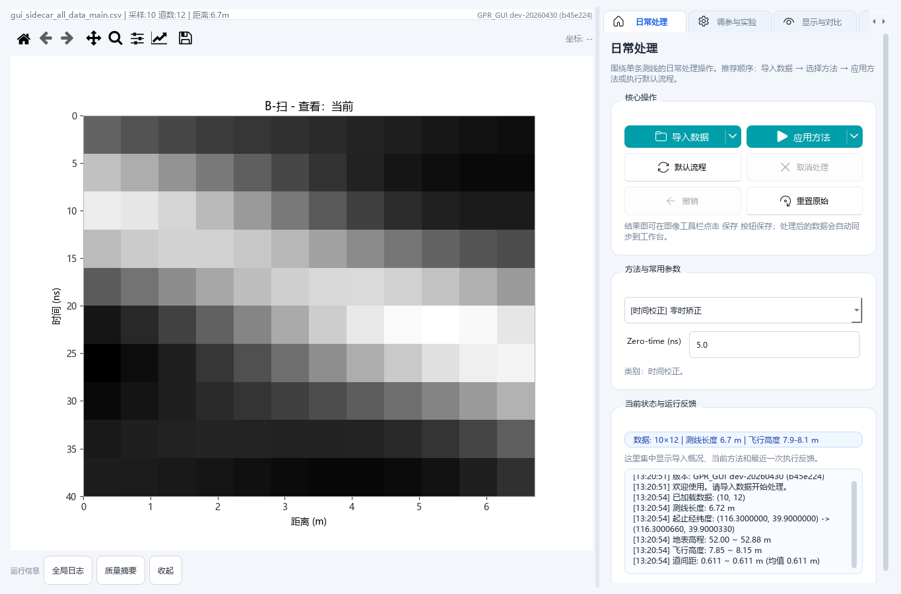
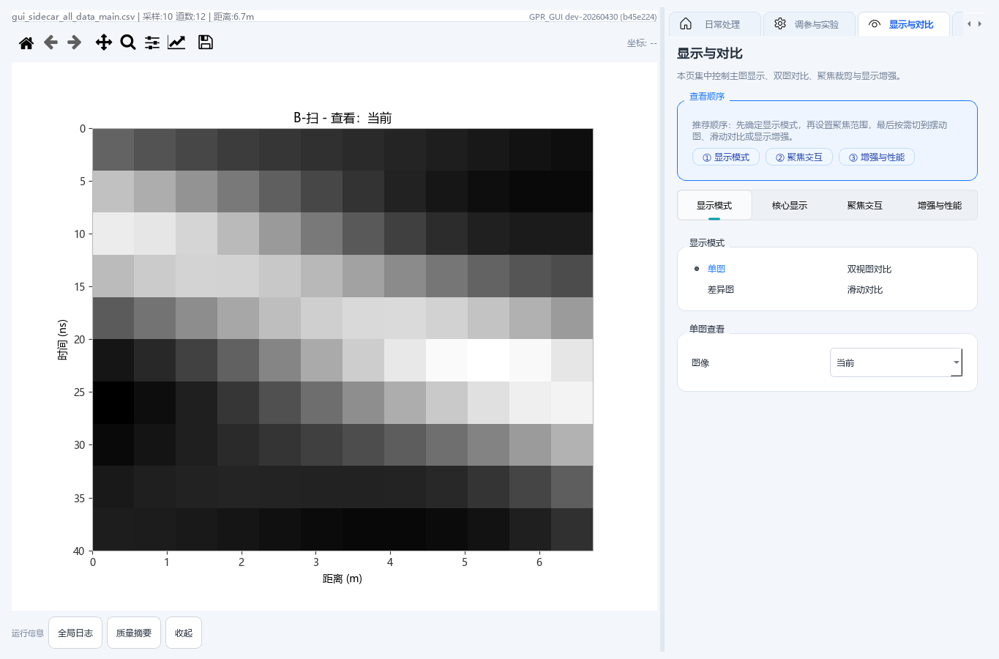
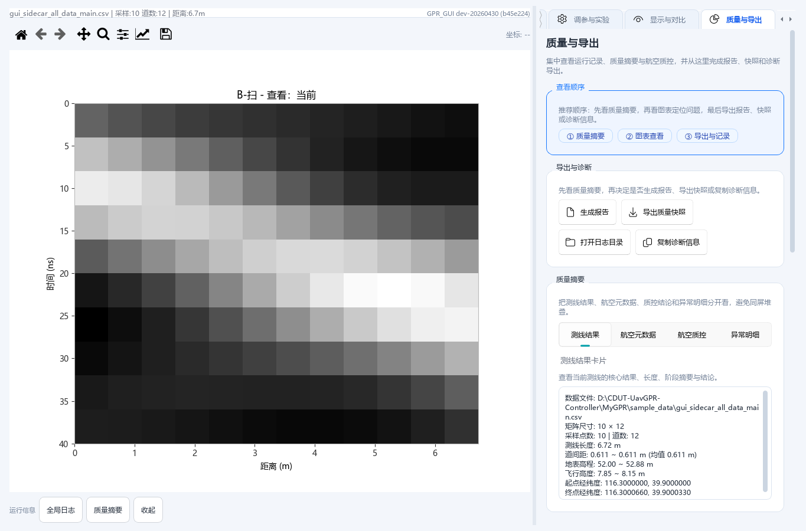
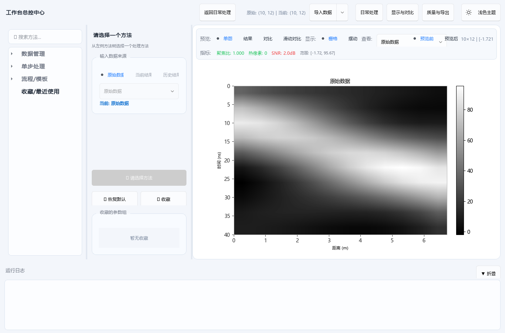

# MyGPR 使用手册

面向对象：现场操作员

适用范围：MyGPR 图形界面（GUI）的数据导入、处理、显示、质量检查、导出和工作台实验流程。

示例数据：`sample_data/gui_sidecar_all_data_main.csv`

> 本手册只覆盖当前 GUI 已提供的功能。CLI 批处理、开发接口、未来采集包自动导入流程不在第一版手册范围内。

## 目录

1. [软件用途与适用场景](#1-软件用途与适用场景)
2. [启动与环境准备](#2-启动与环境准备)
3. [主界面区域说明](#3-主界面区域说明)
4. [数据导入与数据格式要求](#4-数据导入与数据格式要求)
5. [日常处理流程](#5-日常处理流程)
6. [调参与实验](#6-调参与实验)
7. [显示与对比](#7-显示与对比)
8. [质量与导出](#8-质量与导出)
9. [工作台](#9-工作台)
10. [常见问题与排错](#10-常见问题与排错)

## 1. 软件用途与适用场景

MyGPR 用于对无人机或地面平台采集的 GPR 数据进行可视化、预处理、运动补偿、迁移成像、质量查看和结果导出。现场操作时，推荐把它作为“采集后快速检查和处理”的主界面使用。

适合使用 MyGPR 的情况：

- 已有 B-scan CSV 数据，需要快速查看图像质量。
- 已有多条 A-scan CSV，需要合成为一张 B-scan。
- 已有带经纬度、高程、飞行高度的空中堆叠 CSV，需要查看航迹和高度质量。
- 需要对单条测线做去漂移、背景抑制、增益、去噪、运动补偿或迁移成像。
- 需要对比原始数据、当前结果和历史步骤结果。
- 需要导出报告、质量快照、运行记录或诊断信息。

不适合在本版 GUI 里直接完成的情况：

- 直接控制 VNA、RTK、高度计或姿态计采集数据。
- 自动识别完整 DAQ 采集包并一键接入所有传感器元数据。
- 批量处理大量测线的无人值守任务。

## 2. 启动与环境准备

在项目根目录启动统一入口：

```powershell
python launcher.py
```

如果只启动 MyGPR：

```powershell
python MyGPR\app_qt.py
```

也可以进入 `MyGPR` 目录后运行：

```powershell
python app_qt.py
```

Windows 上也可以双击 `MyGPR/启动GPR.bat`。

启动后，未加载数据时主图区域会显示欢迎页，右侧默认停留在“日常处理”页。



使用前建议确认：

- Python 环境和依赖已安装。
- 当前数据文件位于本机可访问目录。
- 输出目录 `output/` 可写。
- 如果要使用 RTK/IMU 辅助文件，先准备好对应 CSV 文件和 trace 时间戳。

## 3. 主界面区域说明

MyGPR 主界面分为两个主要区域：

- 左侧/中央图像区：显示 B-scan、对比图、滑动对比和摆动图。
- 右侧控制区：包含“日常处理”“调参与实验”“显示与对比”“质量与导出”等标签页。

底部运行信息区可展开：

- “全局日志”：查看导入、处理、告警和导出记录。
- “质量摘要”：查看当前质量指标和空中数据质量提示。
- “收起”：隐藏运行信息区，给图像区留出更多空间。

顶部状态栏会显示当前数据名、采样点数、道数、距离、版本等信息。导入空中堆叠 CSV 时，还会显示飞行高度、轨迹长度、道间距等摘要。

## 4. 数据导入与数据格式要求

点击“日常处理”页的“导入数据”按钮可直接导入 CSV。点击按钮右侧箭头可选择更多导入方式。



### 4.1 普通 B-scan CSV

普通 B-scan CSV 是最常用格式。文件内容应为二维数值矩阵：

- 行方向通常表示时间采样点。
- 列方向通常表示 trace / 道。
- 尽量避免非数值列。
- 如果有表头，软件会尝试自动识别并跳过。

导入后，软件会把矩阵显示为 B-scan 图像。

### 4.2 空中堆叠 CSV

空中堆叠 CSV 适用于无人机测线数据。当前支持的主要结构为：

- 文件前部包含测线头信息。
- 后续数据按 trace 堆叠。
- 每行至少包含：经度、纬度、地面高程、幅值、飞行高度。
- 可选第 6 列：`trace_timestamp_s`。

示例文件：

```text
sample_data/gui_sidecar_all_data_main.csv
```

导入这类文件后，MyGPR 会自动提取：

- `longitude`
- `latitude`
- `ground_elevation_m`
- `flight_height_m`
- `trace_distance_m`
- 可选 `trace_timestamp_s`

这些元数据会用于航迹质量、飞行高度质量、运动补偿相关方法和报告摘要。

### 4.3 A-scan 文件夹

当采集结果是一组单道 A-scan CSV 时，选择“导入 A-scan 文件夹”。

要求：

- 文件夹内包含多个 `.csv` 文件。
- 每个 CSV 表示一条 A-scan。
- 文件名最好包含递增编号，例如 `lineData_000001.csv`、`lineData_000002.csv`。
- 软件会按文件名数字排序后拼接为 B-scan。

### 4.4 gprMax `.out`

选择“导入 gprMax .out”可导入 gprMax 仿真输出。软件会读取 `.out` 中的雷达数据并构建 B-scan。

如果同目录存在 `.in` 配置文件，软件会尝试读取道间距等信息；如果没有，会使用默认道间距。

### 4.5 可选 RTK/IMU 辅助文件

RTK/IMU 辅助文件入口位于“显示与对比”页的“可选 RTK/IMU 辅助文件”区域。

使用顺序建议：

1. 进入“显示与对比”。
2. 选择 RTK CSV 和/或 IMU CSV。
3. 再导入主 CSV。

RTK/IMU 辅助文件用于把轨迹和姿态数据融合到每道 trace 元数据中。当前要求主数据能提供 trace 时间戳，或主 CSV 本身包含第 6 列 `trace_timestamp_s`。

RTK/IMU 只是可选增强信息；没有 RTK/IMU 时，普通图像导入和常规处理仍可使用。

## 5. 日常处理流程

“日常处理”是现场操作的主入口。



推荐流程：

1. 点击“导入数据”。
2. 选择 CSV、A-scan 文件夹或 gprMax `.out`。
3. 在“方法与常用参数”中选择处理方法。
4. 检查参数输入框。
5. 点击“应用方法”。
6. 在主图查看处理结果。
7. 根据需要撤销、重置、切到对比页或导出报告。

### 5.1 选择方法

“方法与常用参数”区域列出当前可用处理方法。常见方法包括：

- 零时校正
- Dewow 低频漂移矫正
- 平均/中值背景抑制
- SVD 背景抑制
- F-K 滤波
- Hankel-SVD 去噪
- Wavelet 去噪
- 高度、速度、轨迹、姿态、振动相关运动补偿
- Stolt / Kirchhoff 迁移
- 时间-深度转换
- SEC 增益

不同方法会显示不同参数。现场使用时，先采用默认参数，再根据图像效果小范围调整。

### 5.2 应用方法

点击“应用方法”会使用当前参数处理当前数据。

按钮右侧菜单可切换参数来源：

- 使用当前参数：按当前输入框参数执行。
- 使用自动调参参数：在完成自动选参后，使用推荐参数执行。

处理完成后：

- 主图显示新结果。
- 当前结果会进入历史。
- 日志区记录方法、参数和耗时。
- 工作台会同步当前数据和正式结果。

### 5.3 默认流程

“默认流程”用于快速生成一版可查看结果。它会按内置稳健链路执行一组常用处理步骤，通常包含零时校正、Dewow、背景抑制、增益或杂波抑制等。

适用场景：

- 刚导入数据，需要快速看首版成像效果。
- 不确定应该先选哪个方法。
- 现场需要快速检查数据是否可用。

如果需要精细控制每一步参数，建议改用单方法处理或工作台。

### 5.4 取消、撤销和重置

- “取消处理”：中止当前正在运行的处理任务。
- “撤销”：回到上一步结果，最多保留有限步历史。
- “重置原始”：丢弃处理结果，回到最初导入的数据。

遇到参数设置错误或结果明显异常时，优先用“撤销”回退；如果需要重新开始，用“重置原始”。

## 6. 调参与实验

“调参与实验”用于自动搜索参数、比较同阶段方法，并把推荐方案写回日常处理。


### 6.1 自动选参

自动选参会围绕当前方法生成候选参数，并根据图像质量指标评分。

使用步骤：

1. 在“日常处理”页选择一个方法。
2. 进入“调参与实验”。
3. 设置 ROI 来源和搜索强度。
4. 点击“自动选参”。
5. 点击“查看实验结果”查看推荐档、候选评分和风险提示。

ROI 来源建议：

- 有明确目标区域时，先在主图框选 ROI。
- 没有明确目标时，使用默认 ROI 策略。

搜索强度建议：

- 现场快速检查：使用标准搜索。
- 需要更细结果：提高搜索强度，但耗时会增加。

### 6.2 同阶段实验比较

“同阶段实验比较”会在同一类处理阶段内比较多个候选方法，给出推荐方法和理由。

适合以下情况：

- 不确定该用平均背景抑制、中值背景抑制还是 SVD 背景抑制。
- 不确定同类去噪方法哪个更稳。
- 想把方法选择交给量化指标做第一轮筛选。

比较完成后，可在结果详情中查看推荐方法、候选方法列表和风险提示。

### 6.3 采用推荐方案

当同阶段比较给出明确推荐后，点击“采用推荐方案”可把推荐方法和参数写回“日常处理”页。

采用后仍建议回到主图人工确认：

- 目标反射是否更清晰。
- 背景是否被过度抑制。
- 是否引入条带、热点或明显伪影。

### 6.4 进入工作台

如果需要跨方法串联、多次试验或长期保留实验链路，点击“进入工作台深度实验”。

## 7. 显示与对比

“显示与对比”用于调整主图显示方式、选择对比对象、裁剪范围、ROI 和辅助显示。



### 7.1 显示模式

可用模式包括：

- 单图：只看一个结果。
- 双视图对比：左右并排查看两个结果。
- 差异图：查看两个结果之间的差异。
- 滑动对比：在主图中拖动分隔线，对比处理前后变化。

常用建议：

- 首次查看用“单图”。
- 检查处理效果用“双视图对比”。
- 判断局部变化用“滑动对比”。
- 查找处理引入的异常变化用“差异图”。

### 7.2 单图和对比选择

“单图查看”用于选择当前展示对象，例如原始数据、当前结果或某个历史步骤。

“对比选择”用于设置左右图对象。通常建议：

- 左图选择原始数据。
- 右图选择当前结果或某个处理步骤。

### 7.3 核心显示

核心显示区域可调整：

- 显示形式：普通图像或摆动图。
- 色图：灰度、反转灰度或其他色图。
- 色标：显示或隐藏右侧色标。
- 网格：显示或隐藏参考网格。

摆动图适合观察同相轴和波形结构；普通图像适合整体判断反射强度和层位连续性。

### 7.4 聚焦裁剪

聚焦裁剪用于只查看某段时间或距离范围。

操作建议：

1. 勾选启用裁剪。
2. 输入时间起止或距离起止。
3. 点击“应用裁剪”。
4. 需要恢复完整视图时点击“重置裁剪”。

裁剪只影响显示范围和相关导出视图，不应被理解为删除原始数据。

### 7.5 ROI 状态

ROI 用于给自动选参、局部评估和后续对比提供关注区域。

如果已经框选 ROI，“ROI 状态”会显示当前范围；点击“清除 ROI”可取消。

### 7.6 增强与对比辅助

该区域用于改善显示效果，包括：

- 对称显示正负振幅。
- 百分位拉伸。
- 归一化显示。
- 逐道去均值显示。

这些设置主要服务于显示和判读，不等同于正式处理算法。正式处理结果以“应用方法”或“工作台保存结果”为准。

### 7.7 RTK/IMU 辅助文件

该区域可选择 RTK 和 IMU sidecar 文件。选择后，重新导入带时间戳的主 CSV，软件会尝试把 RTK/IMU 对齐到 trace 元数据中。

如果导入后提示缺少 trace 时间戳，应检查主 CSV 是否包含 `trace_timestamp_s`，或是否导入了与当前数据匹配的时间戳信息。

## 8. 质量与导出

“质量与导出”用于查看质量指标、航迹/高度质量、导出报告和诊断信息。



### 8.1 质量摘要

质量摘要会显示处理质量指标，例如：

- `focus_ratio`：聚焦程度指标。
- `hot_pixels`：热点像素数量。
- `spikiness`：尖峰程度。
- `time_ms`：处理耗时。

如果导入了空中测线元数据，还会显示：

- `track_length_m`
- `trace_spacing_cv`
- `flight_height_span_m`
- 道间距异常点
- 高度异常点

### 8.2 图表查看

图表查看区域用于检查：

- 道间距稳定性。
- 飞行高度稳定性。
- 航迹分布。
- 异常点位置。

在航迹图中点击点位时，主图会联动到对应 trace，方便定位异常。

### 8.3 生成报告

点击“生成报告”会在输出目录生成报告 Markdown 和当前图像截图。

报告通常包含：

- 数据文件路径。
- 测线摘要。
- 最近一次处理流程。
- 当前方法和参数。
- 裁剪和显示设置。
- 质量指标。
- 空中元数据质量摘要。
- 运行日志。

输出目录通常为：

```text
output/
```

报告文件名形如：

```text
report_YYYYMMDD_HHMMSS.md
report_YYYYMMDD_HHMMSS.png
```

### 8.4 导出质量快照

点击“导出质量快照”会导出 JSON 和 CSV。

注意：必须先运行一次处理流程，软件才有可导出的质量指标。

输出文件名形如：

```text
quality_snapshot_YYYYMMDD_HHMMSS.json
quality_snapshot_YYYYMMDD_HHMMSS.csv
```

JSON 适合保留完整诊断信息；CSV 适合用表格软件汇总多次结果。

### 8.5 日志和诊断

- “打开日志目录”：打开日志和输出目录。
- “复制诊断信息”：把当前环境、数据状态和日志摘要复制到剪贴板。
- “导出记录”：把运行记录保存为文本文件。

遇到问题需要反馈时，优先提供：

- 原始数据文件名和数据尺寸。
- 当前方法和参数。
- 错误弹窗内容。
- 运行记录或诊断信息。
- 如果是空中数据，附带 RTK/IMU/高度字段情况。

## 9. 工作台

工作台用于更深入的手工实验。它适合跨方法组合、反复试验、查看预览结果，并在确认后把结果保存为正式结果。



进入方式：

- 在“调参与实验”页点击“进入工作台深度实验”。
- 在工作台顶部可点击“日常处理”“显示与对比”“质量与导出”返回对应页面。

### 9.1 方法树

左侧方法树按功能分组，例如：

- 数据管理
- 单步处理
- 流程/模板
- 收藏/最近使用

点击方法后，中间参数区会显示该方法说明和参数。

### 9.2 输入来源

工作台支持选择输入来源：

- 原始数据：从最初导入的数据开始处理。
- 当前结果：从主界面当前结果继续处理。
- 历史结果：从某个已保存步骤继续处理。

如果只是试验某个新方法，建议先用“当前结果”；如果要重新设计完整链路，建议从“原始数据”开始。

### 9.3 预览结果

点击“应用当前方法”后，工作台会生成预览结果。预览结果不会立即覆盖主界面的正式结果。

预览区可以查看：

- 单图
- 结果
- 对比
- 滑动对比
- 栅格/摆动显示

这样可以先判断处理效果，再决定是否保存。

### 9.4 保存为正式结果

确认预览结果可用后，点击保存结果相关按钮，把预览提交为正式结果。提交后：

- 主界面当前结果会更新。
- 历史结果会增加一步。
- “显示与对比”页可选择该步骤进行对比。
- “质量与导出”页可记录该步骤。

如果预览结果不合适，取消预览或换参数重新运行。

## 10. 常见问题与排错

### 10.1 导入 CSV 后图像方向不对

检查 CSV 是否为“采样点 x trace”的二维矩阵。若数据转置存储，可先在外部工具中转置，或检查采集导出格式。

### 10.2 CSV 导入失败

常见原因：

- 文件中有非数值列。
- 表头行过多或混入注释。
- 空值、NaN、Inf 过多。
- 文件正在被其他程序占用。

处理建议：

1. 用表格软件或文本编辑器打开 CSV。
2. 确认主要数据区域是二维数值。
3. 删除无关说明列。
4. 重新导入。

### 10.3 RTK/IMU 辅助文件没有生效

检查：

- 是否在导入主 CSV 前选择了 RTK/IMU 文件。
- 主 CSV 是否包含 `trace_timestamp_s`。
- RTK/IMU 文件是否包含可解析的 `timestamp_s`。
- RTK/IMU 时间范围是否覆盖主 CSV 的 trace 时间。

RTK/IMU 不是必需项；没有它们时，普通处理仍可继续。

### 10.4 质量快照无法导出

质量快照依赖最近一次处理的质量指标。请先执行“应用方法”或“默认流程”，再导出质量快照。

### 10.5 自动选参耗时较长

自动选参会运行多个候选参数。耗时与数据大小、ROI 范围、搜索强度和方法复杂度有关。

建议：

- 先框选较小 ROI。
- 使用标准搜索强度。
- 对大数据先做显示裁剪，再决定是否需要更细搜索。

### 10.6 处理后目标变弱或背景过度抑制

可能原因：

- 背景抑制窗口过大。
- 去噪参数过激。
- 增益或归一化设置不合适。
- 误把目标区域作为背景抑制掉。

处理建议：

1. 用“双视图对比”查看原始数据和处理结果。
2. 用“撤销”回退一步。
3. 降低处理强度或改用更保守方法。
4. 在工作台中用预览方式试验，不直接覆盖正式结果。

### 10.7 图像看起来过暗或过亮

优先调整显示设置：

- 切换色图。
- 开启或关闭反转色图。
- 使用百分位拉伸。
- 开启对称显示。

这些操作主要影响显示，不会改变正式数据。

### 10.8 不知道该从哪个功能开始

现场推荐路线：

1. 导入数据。
2. 看主图是否正常。
3. 点击“默认流程”得到首版结果。
4. 进入“显示与对比”查看处理前后差异。
5. 进入“质量与导出”检查质量摘要。
6. 如果需要更精细结果，再使用“调参与实验”或“工作台”。
